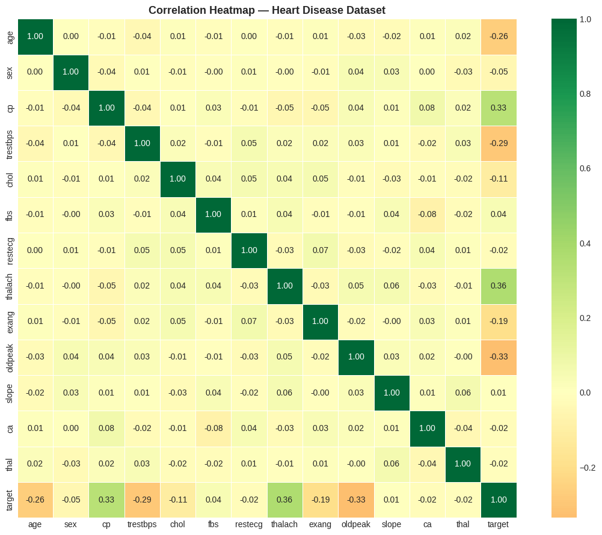

# 🏥 Heart Disease Prediction from Medical Data

## CodeAlpha Machine Learning Internship — Task 4

[](https://python.org)
[](https://scikit-learn.org)
[](https://xgboost.readthedocs.io)
[](https://pandas.pydata.org)
[](https://numpy.org)
[](https://matplotlib.org)

---

## 📌 Objective

Build a machine learning system to predict the presence of heart disease in a patient using clinical medical data. Multiple classification algorithms are compared and evaluated to identify the best performing model.

---

## 🛠️ Algorithms Used

| Algorithm | Type |
|---|---|
| Logistic Regression | Linear Classifier |
| Support Vector Machine (SVM — RBF Kernel) | Kernel-based |
| Random Forest | Ensemble — Bagging |
| XGBoost | Ensemble — Boosting |

---

## 📊 Dataset

- **Source:** UCI Heart Disease Dataset (Cleveland)
- **Records:** 1,025 patient records
- **Features:** 13 medical attributes
- **Target:** `0` = No Heart Disease, `1` = Heart Disease Present

| Feature | Description |
|---|---|
| age | Age of the patient |
| sex | Gender (1 = Male, 0 = Female) |
| cp | Chest pain type (0–3) |
| trestbps | Resting blood pressure (mm Hg) |
| chol | Serum cholesterol (mg/dl) |
| fbs | Fasting blood sugar > 120 mg/dl |
| restecg | Resting ECG results (0–2) |
| thalach | Maximum heart rate achieved |
| exang | Exercise induced angina |
| oldpeak | ST depression induced by exercise |
| slope | Slope of peak exercise ST segment |
| ca | Number of major vessels (0–3) |
| thal | Thalassemia type |

---

## 📁 Project Structure

```
CodeAlpha_DiseasePrediction/
├── image/
│   ├── confusion matrix.png
│   ├── feature analysis.png
│   ├── feature importance.png
│   ├── heatmap.png
│   ├── model comparison.png
│   └── target distribution.png
├── notebook/
│   └── disease_prediction (1).ipynb
├── .gitignore
├── requirements.txt
├── LICENSE
└── README.md
```

---

## 🚀 How to Run

**Option 1 — Google Colab (Recommended)**

[](https://colab.research.google.com/github/Rosesharma13/CodeAlpha_DiseasePrediction/blob/main/notebook/disease_prediction%20(1).ipynb)

**Option 2 — Local Setup**

```bash
git clone https://github.com/Rosesharma13/CodeAlpha_DiseasePrediction.git
cd CodeAlpha_DiseasePrediction
pip install -r requirements.txt
jupyter notebook notebook/disease_prediction\ \(1\).ipynb
```

---

## 📊 Exploratory Data Analysis (EDA)

### 🔹 Target Distribution

Class balance between heart disease positive and negative patients.

---

### 🔹 Feature Analysis

Distribution of key medical features across the dataset.

---

### 🔹 Correlation Heatmap

Relationships between features help identify the most predictive medical attributes.

---

## 🤖 Model Building & Comparison

### 🔹 Model Comparison

All four models trained and compared using Accuracy, F1-Score, and ROC-AUC.

---

## 🌲 Best Model Insights

### 🔹 Feature Importance

Most influential medical features driving the prediction decision.

---

### 🔹 Confusion Matrix

Classification performance showing true positives, false positives, and error distribution.

---

## 📈 Results

- Four models benchmarked — best selected via ROC-AUC cross-validation
- Confusion matrix analysis on best performing model
- Feature importance reveals most predictive clinical attributes
- Metrics: Accuracy, Precision, Recall, F1-Score, ROC-AUC

---

## 🔮 Future Improvements

- Hyperparameter tuning with GridSearchCV
- Deploy as Streamlit web application
- Add SHAP values for model explainability
- Test on larger real-world clinical datasets

---

## 🙌 Acknowledgements

- Dataset: UCI Machine Learning Repository — Heart Disease Dataset
- Built as part of CodeAlpha Machine Learning Internship — Task 4

---

## 👩‍💻 Author

**Rose Sharma** | CodeAlpha ML Internship

[](https://www.linkedin.com/in/rose-sharma13)
[](https://github.com/Rosesharma13)
